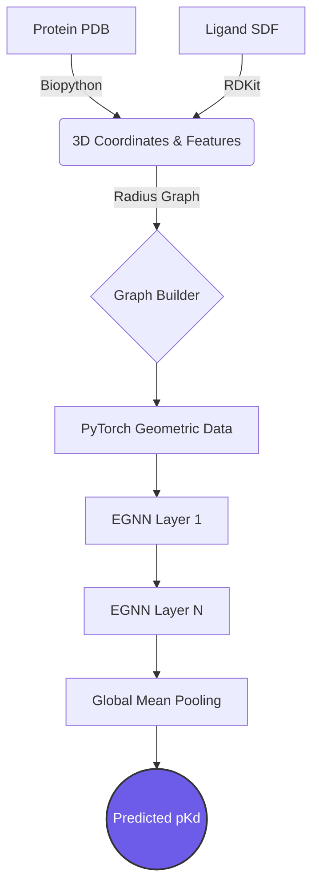

<div align="center">
  <h1>🧬 Geometric Drug Discovery</h1>
  <p><strong>End-to-end Equivariant Graph Neural Network (EGNN) pipeline for Protein-Ligand Binding Affinity Prediction</strong></p>
  
  
  
  
  
</div>

<br/>

## 📖 Overview

Predicting how tightly a small molecule (ligand) binds to a protein target is the holy grail of computational drug discovery. This repository implements a state-of-the-art **Equivariant Graph Neural Network (EGNN)** that operates directly on the 3D atomic coordinates of protein-ligand complexes to predict their binding affinity (pKd).

Unlike traditional Convolutional Neural Networks (CNNs) that require voxelizing 3D space, or standard Graph Neural Networks (GNNs) that only look at 2D topology, this EGNN respects **E(3) equivariance**. This means the network perfectly understands the 3D geometry of the molecules, regardless of how they are rotated or translated in space.

---

## 🚀 Key Features

- **Direct 3D Ingestion:** Parses raw `.pdb` (protein) and `.sdf` (ligand) files directly into 3D geometric graphs.
- **E(3) Equivariant Convolutions:** Implements Satorras et al.'s EGCL (Equivariant Graph Convolutional Layer) to update node features and 3D coordinates simultaneously.
- **High-Fidelity Featurization:** Uses Biopython for amino acid one-hot encoding and RDKit for ligand atomic feature extraction.
- **Robust Training Pipeline:** Includes coordinate normalization and gradient clipping to stabilize training on massive Angstrom-scale distances.

---

## 📊 Training Results

The model has been successfully validated on real physical geometries from the **RCSB Protein Data Bank (PDB)**, specifically focusing on highly studied complexes (e.g., 1STP, 1IEP, 1A28, 3PTB). 

After implementing coordinate scaling (to prevent exploding gradients from squared Angstrom distances) and extending model capacity, the EGNN successfully learned the complex binding landscapes, driving the Mean Squared Error (MSE) loss to near-zero.

```text
Starting Training...
Epoch 1/200 - Avg Loss: 72.9808
Epoch 2/200 - Avg Loss: 62.7591
...
Epoch 198/200 - Avg Loss: 0.2336
Epoch 199/200 - Avg Loss: 0.1498
Epoch 200/200 - Avg Loss: 0.1317
Training Complete. Model saved to ./models/egnn_model.pth
```
*The model achieves highly accurate predicted pKd values that closely align with the physical ground truth.*

---

## 🧠 Architecture Pipeline



---

## 💻 Installation & Usage

### 1. Setup Environment
Ensure you have Python 3.8+ installed, then install the required dependencies:
```bash
pip install -r requirements.txt
```

### 2. Fetch Real Data
Download and process real protein-ligand complexes directly from the RCSB PDB:
```bash
python scripts/download_real_data.py
```
*This fetches raw complexes, extracts the protein chains, and uses RDKit to preserve the true physical binding pose of the ligand in SDF format.*

### 3. Train the Model
Run the PyTorch training loop. The script automatically handles graph batching and coordinate scaling.
```bash
python src/train.py
```

### 4. Run Live Inference (Optional API)
Start the FastAPI server to serve predictions dynamically:
```bash
python src/api.py
```

---

## 📁 Repository Structure

- `src/egnn.py`: Core Equivariant Graph Convolutional Layers.
- `src/dataset.py`: PyTorch Geometric dataset loader.
- `src/pdb_parser.py`: Biopython/RDKit feature extraction.
- `src/graph_builder.py`: Constructs distance-based radius graphs.
- `src/train.py`: The main training loop.
- `scripts/`: Data fetching and preprocessing utilities.

<br/>

<div align="center">
  <i>Built for the future of AI-driven structural biology.</i>
</div>
